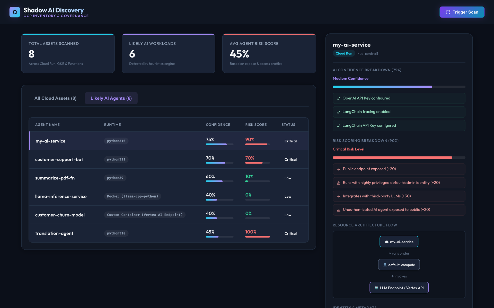
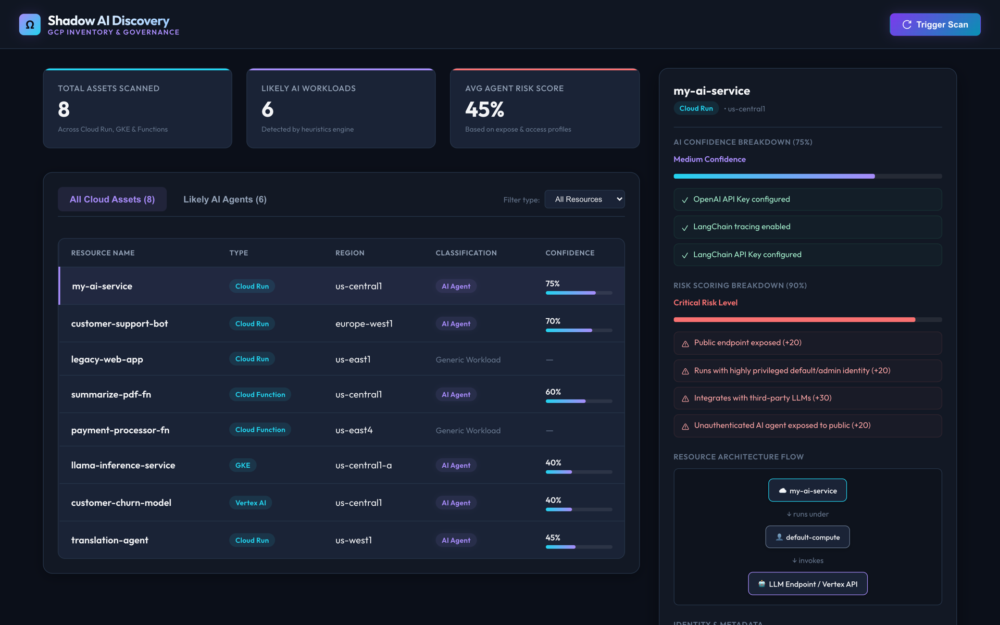

# 🛡️ Shadow AI Discovery Engine

A lightweight governance platform designed to scan, inventory, and assess AI-enabled workloads (Shadow AI Agents) running inside Google Cloud Platform (GCP) projects.

---

## ✨ Features
* **Multi-Resource Scanning**: Detects workloads across Cloud Run, Cloud Functions, GKE, and Vertex AI. GKE scanning lists clusters via the Container API, then inventories each cluster's Deployments (container images, env vars, Workload Identity bindings) through the Kubernetes API.
* **Heuristics Scoring Engine**: Evaluates environment variables, container images, resource naming patterns, and IAM permissions to assign a **Confidence Score (0-100%)** of whether a workload is an autonomous AI agent.
* **Cloud Logging Integration (Bonus 1)**: Queries Cloud Logging for `protoPayload.serviceName="aiplatform.googleapis.com"` entries to confirm a workload's service account actually called the Vertex AI API — verified runtime behavior, not just static metadata, adds a further +40 to the confidence score.
* **Architecture Flow Diagram (Bonus 2)**: Renders a reactive relationship visualization showing the workload's flow (`Resource -> IAM Service Account -> AI Service`).
* **Risk Profiling (Bonus 3)**: Computes a compound **Risk Score (0-100%)** assessing security vulnerability (public ingress verified via IAM `allUsers` bindings, default/admin identity permissions, external API communication).
* **Container SBOM Analysis (Bonus 4)**: Queries the Container Analysis (Grafeas) API for `PACKAGE` occurrences inside each container image, surfacing installed libraries like `langchain` or `crewai` even when the image name itself is opaque; falls back gracefully if the API isn't enabled.
* **Incremental Scanning (Bonus 5)**: Compares each Cloud Run/Cloud Functions/Vertex AI resource's `update_time` against the last successful scan and skips IAM policy reads, SBOM lookups, and heuristics scoring for resources that haven't changed.
* **Secret-Safe Inventory**: Env var values with credential-looking keys (`*_KEY`, `*_SECRET`, `*_TOKEN`, ...) are masked before persistence — values are masked to a short vendor-prefix hint (e.g. keeping only the first 4 characters for context).
* **Zero-Setup Demo Mode**: Automatically detects if live GCP credentials are not set and falls back to a highly realistic mock discovery catalog, making the dashboard fully functional out-of-the-box.

---

## 📸 Screenshots

| Agents view | Assets view |
| :--- | :--- |
|  |  |

Agent details (confidence breakdown, risk scoring, architecture flow): [docs/screenshots/agent-details.png](docs/screenshots/agent-details.png)

---

## 🛠️ Tech Stack
* **Backend**: Python, FastAPI, SQLModel (SQLAlchemy + Pydantic), SQLite.
* **Frontend**: React, TypeScript, Vite, Vanilla CSS (custom glassmorphic theme).
* **API Specs**: Automatic Swagger docs (`http://localhost:8000/docs`).

---

## 📁 Project Structure
```
shadow-ai-discovery/
├── backend/
│   ├── app/
│   │   ├── config.py            # Settings and prefixes
│   │   ├── database.py          # SQLite engine & sessions
│   │   ├── main.py              # FastAPI app
│   │   ├── models.py            # SQLModel schemas
│   │   ├── routes/              # Endpoints (assets, agents, scans)
│   │   └── services/            # Core logic (scanner, heuristics)
│   ├── tests/                   # Pytest suite (heuristics + API lifecycle)
│   ├── requirements.txt
│   └── database.db              # Local SQLite database (generated)
├── frontend/
│   ├── src/
│   │   ├── services/api.ts      # REST API client
│   │   ├── styles/index.css     # Design system & CSS properties
│   │   ├── App.tsx              # Dashboard interface
│   │   └── main.tsx
│   ├── package.json
│   └── vite.config.ts
├── ARCHITECTURE.md              # Engineering decisions & scaling docs
└── README.md                    # Setup & user guide
```

---

## 🚀 Setup & Installation

### Prerequisite
* Python 3.13+ (or let `uv` manage the installation automatically)
* Node.js 18+

### Step 1: Clone the Repository & Start the Backend
1. Open a terminal and navigate to the backend directory:
   ```bash
   cd backend
   ```
2. Create and sync the Python virtual environment:
   ```bash
   uv sync
   ```
3. Start the FastAPI development server:
   ```bash
   uv run uvicorn app.main:app --host 0.0.0.0 --port 8000 --reload
   ```
The backend API is now running at `http://localhost:8000`. You can explore the interactive API docs at `http://localhost:8000/docs`.

### Step 2: Start the Frontend Dashboard
1. Open a separate terminal and navigate to the frontend directory:
   ```bash
   cd frontend
   ```
2. Install npm packages:
   ```bash
   npm install
   ```
3. Run the Vite development server:
   ```bash
   npm run dev
   ```
The dashboard interface will be available at `http://localhost:5173`. Open it in your web browser.

### Running the Tests
```bash
cd backend
uv run pytest
```
The suite covers the heuristics engine (confidence + risk scoring, env var redaction) and the full scan lifecycle through the REST API against a throwaway database.

---

## 📡 REST API Endpoints

| Method | Endpoint | Description |
| :--- | :--- | :--- |
| **GET** | `/api/assets` | Retrieve all scanned GCP workloads (paginated via `skip`/`limit` query params) |
| **GET** | `/api/assets/{id}` | Retrieve details of a specific asset |
| **GET** | `/api/agents` | Retrieve only workloads classified as AI Agents (paginated via `skip`/`limit`) |
| **GET** | `/api/agents/{id}` | Retrieve details of a specific AI Agent workload |
| **POST** | `/api/scan` | Trigger a new discovery scan; returns `202 Accepted` immediately and runs as a background task |
| **GET** | `/api/scan/history` | Retrieve history and stats of all scans |

### Example Responses

`POST /api/scan` — returns immediately; the scan runs as a background task:
```json
{
  "id": "scan-a70f62bb",
  "timestamp": "2026-07-07T04:06:44.040262",
  "status": "running",
  "assets_found": 0,
  "agents_found": 0,
  "error_message": null
}
```

`GET /api/scan/history` — the same scan after completion:
```json
[
  {
    "id": "scan-a70f62bb",
    "timestamp": "2026-07-07T04:06:44.040262",
    "status": "completed",
    "assets_found": 8,
    "agents_found": 6,
    "error_message": null
  }
]
```

`GET /api/agents/run-my-ai-service` — note the masked credential values:
```json
{
  "id": "run-my-ai-service",
  "name": "my-ai-service",
  "resource_type": "Cloud Run",
  "region": "us-central1",
  "runtime": "python310",
  "service_account": "default-compute@developer.gserviceaccount.com",
  "env_vars": {
    "OPENAI_API_KEY": "sk-p********************",
    "LANGCHAIN_TRACING_V2": "true",
    "LANGCHAIN_API_KEY": "lsv2********************",
    "PORT": "8080"
  },
  "labels": {
    "allow-unauthenticated": "true",
    "env": "production",
    "team": "ai-rnd"
  },
  "is_ai_agent": true,
  "confidence_score": 75,
  "confidence_reasons": [
    "OpenAI API Key configured",
    "LangChain tracing enabled",
    "LangChain API Key configured"
  ],
  "risk_score": 90,
  "risk_reasons": [
    "Public endpoint exposed (+20)",
    "Runs with highly privileged default/admin identity (+20)",
    "Integrates with third-party LLMs (+30)",
    "Unauthenticated AI agent exposed to public (+20)"
  ],
  "last_seen": "2026-07-07T04:06:44.045651"
}
```

---

## 🔑 GCP Service Account Integration (Optional)
To query live resources instead of using Demo Mode:
1. Provide a Service Account with **Viewer**, **Cloud Run Viewer**, and **Kubernetes Engine Viewer** (`roles/container.viewer`, needed to list clusters and read workloads through the Kubernetes API) roles on the target GCP project.
2. Export the path to the Service Account JSON key:
   ```bash
   export GOOGLE_APPLICATION_CREDENTIALS="/path/to/key.json"
   ```
3. Set your project ID environment variable:
   ```bash
   export SHADOW_AI_GCP_PROJECT_ID="your-project-id"
   ```
4. Re-run the backend server and trigger a scan.
